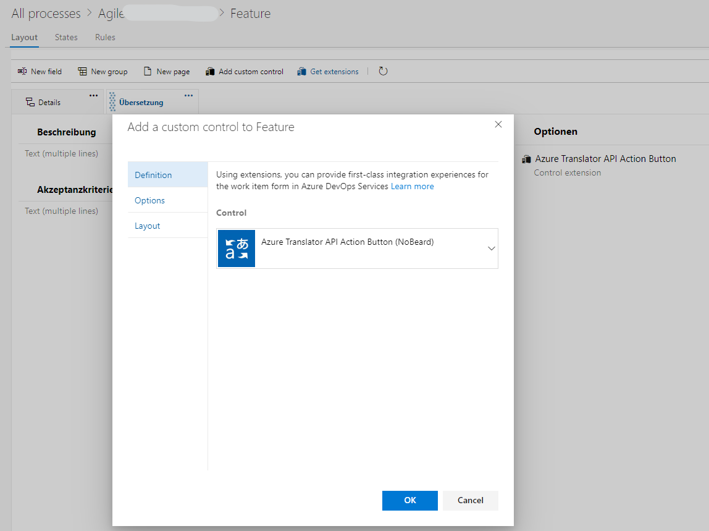
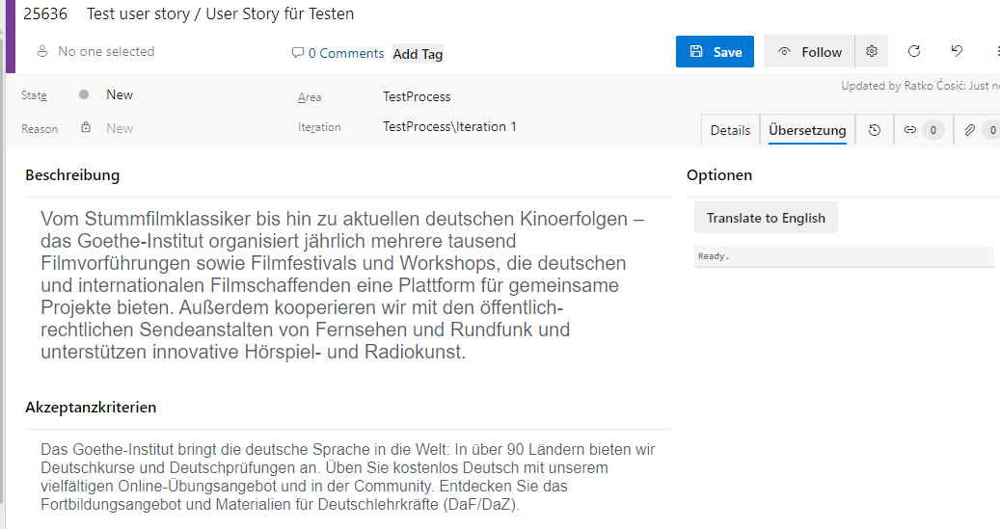
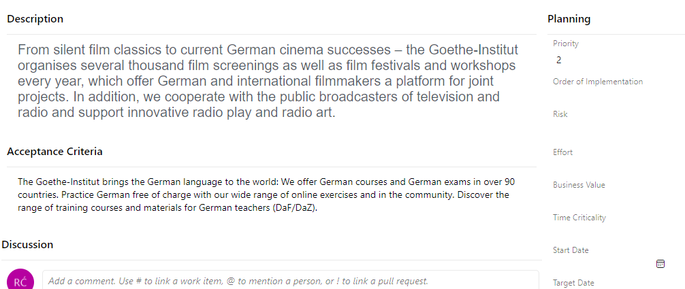

# Azure Translator API Action Button

This extension provides an action button for translating fields by using Azure AI Translator API.

## Dependencies

The extension depends on a few Azure DevOps packages:

- [azure-devops-extension-sdk](https://github.com/Microsoft/azure-devops-extension-sdk): Required module for Azure DevOps extensions which allows communication between the host page and the extension iframe.
- [azure-devops-extension-api](https://github.com/Microsoft/azure-devops-extension-api): Contains REST client libraries for the various Azure DevOps feature areas.
- [azure-devops-ui](https://developer.microsoft.com/azure-devops): UI library containing the React components used in the Azure DevOps web UI.

Libraries used:

- `React` - Is used to render the UI, and is a dependency of `azure-devops-ui`.
- `TypeScript` - Code is written in TypeScript and compiled to JavaScript
- `SASS` - Extension is styled using SASS (which is compiled to CSS and delivered in webpack js bundles).
- `webpack` - Is used to gather dependencies into a single javascript bundle for each sample.

## Usage

In your project settings, under `Boards > Process > [ Your work item type of choice ]`, select the extension. The following dialog will appear:

You need to configure a few mandatory settings:

- `ButtonTitle`: Text you want displayed on the button
- `SourceFields`: Fields of the work item you want to translate (comma separated) - _example: 'Beschreibung,Akzeptanzkriterien'_
- `DestinationFields`: Fields that will contain the translated texts (comma separated) - _example: 'Description,Acceptance Criteria'_
- `AzureTranslatorApiKey`: Secret key used to access Azure AI Translator API - _example: '13231321321321321321321321'_
- `AzureTranslatorApiRegion`: Region of the Azure AI Translator API - _example: 'westeurope'_
- `SourceLanguage`: The language of the original text - _example: 'de'_
- `TargetLanguage`: The language of the translated text - _example: 'hr'_

After you set the parameters, go to your WIT with custom control configured, and fill out text in source fields:

Click on button to activate the translation. Destination fields should be populated with the text in target language:

